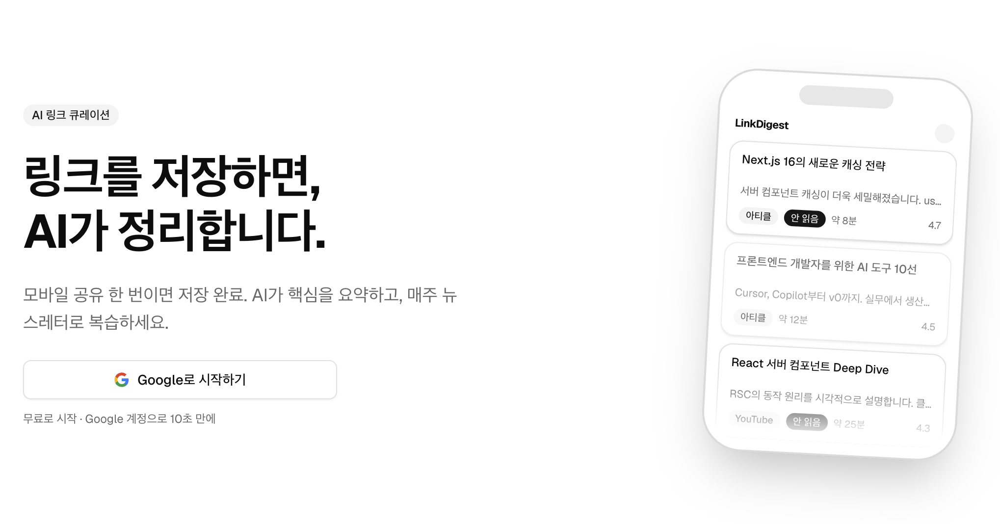

[한국어](docs/README%28kr%29.md) | English

# LinkDigest


**LinkDigest** is an AI-powered link curation service that instantly summarizes saved links and delivers weekly newsletter digests. Share a link from your phone — AI organizes the rest.

<p align="center">
  
</p>

## Core Capabilities

- **PWA Share Target** — Save links directly from your mobile browser's share menu with zero friction
- **AI Summarization** — Get one-line summaries and key takeaways for articles and YouTube videos powered by OpenAI, Anthropic, or Google LLMs
- **Weekly Newsletter** — Receive a curated digest of your saved links every week via email
- **Link Dashboard** — Browse, search, and manage all your saved links with read/unread status tracking
- **Notifications** — Stay informed through Slack or Telegram webhook integrations
- **Google OAuth** — Sign in with your Google account in 10 seconds, no sign-up required

## Technical Foundation

- **Framework** — Next.js 16 (App Router) with TypeScript in strict mode
- **Styling** — TailwindCSS v4 + shadcn/ui (New York), mobile-first design
- **Auth & Database** — Supabase (Google OAuth + PostgreSQL with Row Level Security)
- **AI** — Multi-provider LLM support (OpenAI / Anthropic / Google)
- **Email** — Resend for transactional and newsletter delivery
- **PWA** — serwist for offline support and Share Target integration
- **Deployment** — Vercel with Cron Jobs for scheduled tasks

## Getting Started

Prerequisites: Node.js 20+, a Supabase project, and API keys for your preferred LLM provider.

```bash
git clone https://github.com/sguys99/link-digest.git
cd link-digest
npm install
cp .env.example .env.local
# Configure environment variables in .env.local
npm run dev
```

The development server starts at `http://localhost:3000`.


## License

This project is licensed under the [Apache License 2.0](LICENSE).
